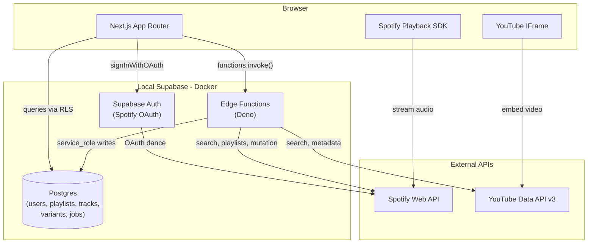

# CoverSpot MVP Implementation Plan

> **For Claude:** REQUIRED SUB-SKILL: Use superpowers:executing-plans to implement this plan task-by-task.

**Goal:** Deliver a locally-testable end-to-end CoverSpot MVP -- login via Spotify, sync playlists, discover variants, preview audio/video, and add/swap tracks.

**Architecture:** Next.js App Router frontend connects to local Supabase (Postgres + Auth). Supabase Edge Functions (Deno) handle server-side orchestration: token refresh, playlist sync, variant discovery, and playlist mutation. Spotify and YouTube APIs are called only from Edge Functions to protect API keys.

**Tech Stack:** Next.js 15 (App Router, TypeScript), Tailwind CSS + shadcn/ui, Supabase (Postgres, Auth, Edge Functions/Deno), Spotify Web API, YouTube Data API v3, Spotify Web Playback SDK, YouTube IFrame Player API.

---

## Architecture




## Prerequisites

- **Docker Desktop** installed and running (required for local Supabase)
- **Node.js 18+** installed
- **Supabase CLI** installed (`npm i -g supabase`)
- **Spotify Developer Dashboard** app created with redirect URI `http://127.0.0.1:54321/auth/v1/callback` added
- **YouTube Data API v3** enabled in Google Cloud Console
- Existing API keys already configured in `.env` files (already done)

---

## Task 1: Project Initialization

Initialize a Next.js project and install all MVP dependencies.

**Create:**

- `package.json` (via create-next-app)
- `next.config.ts`
- `tsconfig.json`
- `tailwind.config.ts`
- `src/app/layout.tsx`, `src/app/page.tsx`, `src/app/globals.css`

**Steps:**

1. Run `npx create-next-app@latest . --typescript --tailwind --eslint --app --src-dir --import-alias "@/*"` (use `--yes` or accept defaults; the `.` uses the existing directory)
2. Install Supabase client: `npm install @supabase/supabase-js @supabase/ssr`
3. Initialize shadcn/ui: `npx shadcn@latest init` (select defaults, New York style)
4. Add UI components: `npx shadcn@latest add button card dialog toast tabs skeleton badge separator dropdown-menu avatar`
5. Fix root `.env` to use correct variable names per the [environment doc](Environment%20Setup%20-%20API%20Keys%20and%20.env.md):
  - Rename `SUPABASE_URL` to `NEXT_PUBLIC_SUPABASE_URL`
  - Rename `SUPABASE_ANON_KEY` to `NEXT_PUBLIC_SUPABASE_ANON_KEY`
  - Add `NEXT_PUBLIC_SPOTIFY_SCOPES` variable
  - Remove `SPOTIFY_REDIRECT_URI` (Supabase Auth manages the redirect)
  - Add `SUPABASE_SERVICE_ROLE_KEY` (copy from `supabase/functions/.env`)
6. Create `.env.example` and `supabase/functions/.env.example` with blank placeholders

---

## Task 2: Supabase Local Setup

Initialize the Supabase project directory and configure the Spotify auth provider.

**Create:**

- `supabase/config.toml` (via `supabase init`)

**Steps:**

1. Run `supabase init` (creates `supabase/config.toml`)
2. Edit `supabase/config.toml` to enable the Spotify provider:

```toml
[auth.external.spotify]
enabled = true
client_id = "env(SPOTIFY_CLIENT_ID)"
secret = "env(SPOTIFY_CLIENT_SECRET)"
redirect_uri = ""
```

1. Also set the `site_url` and `additional_redirect_urls` in config.toml:

```toml
[auth]
site_url = "http://127.0.0.1:3000"
additional_redirect_urls = ["http://127.0.0.1:3000/auth/callback"]
```

1. Run `supabase start` to verify local services spin up
2. Note the local API URL, anon key, and service role key printed in the output
3. Create `.env.local` with local Supabase overrides (takes precedence over `.env`):

```env
NEXT_PUBLIC_SUPABASE_URL=http://127.0.0.1:54321
NEXT_PUBLIC_SUPABASE_ANON_KEY=<from supabase start output>
SUPABASE_SERVICE_ROLE_KEY=<from supabase start output>
```

1. Similarly update `supabase/functions/.env` with local values for `SUPABASE_URL`, `SUPABASE_ANON_KEY`, `SUPABASE_SERVICE_ROLE_KEY` (keep real Spotify/YouTube/Gemini keys)

---

## Task 3: Database Schema and RLS

Create a single migration file containing all Phase 1 tables and Row Level Security policies.

**Create:**

- `supabase/migrations/00001_initial_schema.sql`

**Tables** (per PRD Section 5):

- `users` -- extends auth.users with Spotify tokens, premium_status
- `spotify_playlists` -- cached playlists with snapshot_id
- `spotify_tracks` -- global deduplicated track cache
- `playlist_tracks_link` -- junction table with 0-based position
- `track_variants` -- variant relationship engine (original -> variant, status, platform)
- `mutation_jobs` -- audit trail for add/swap operations
- `sync_jobs` -- playlist sync execution tracking

**Key schema decisions:**

- `users.id` references `auth.users(id)` ON DELETE CASCADE
- `spotify_playlists` has UNIQUE on `(user_id, spotify_playlist_id)` (not just `spotify_playlist_id` since the same playlist can be in multiple users' libraries)
- `track_variants.platform_id` is UNIQUE to prevent duplicate variant entries
- `playlist_tracks_link` primary key is `(playlist_id, track_id, position)`
- Enable `pg_cron` and `pg_net` extensions

**RLS policies:**

- `users`: users can only read/update their own row (`auth.uid() = id`)
- `spotify_playlists` + `playlist_tracks_link`: read only where `user_id = auth.uid()`; writes via service-role
- `spotify_tracks` + `track_variants`: read-only for authenticated users; writes via service-role
- `mutation_jobs` + `sync_jobs`: read own rows; writes via service-role

**Also create a trigger:** on `auth.users` INSERT, auto-create a `public.users` row with the `auth.uid()` as `id`. This ensures the user record exists before the auth callback tries to update it with Spotify tokens.

**Apply:** `supabase db reset` to apply migration to local DB

---

## Task 4: Supabase Client Utilities and Auth Middleware

Set up the Supabase client helpers following the `@supabase/ssr` pattern for Next.js App Router.

**Create:**

- `[src/lib/supabase/client.ts](src/lib/supabase/client.ts)` -- browser client via `createBrowserClient()`
- `[src/lib/supabase/server.ts](src/lib/supabase/server.ts)` -- server client via `createServerClient()` using `cookies()`
- `[src/lib/supabase/admin.ts](src/lib/supabase/admin.ts)` -- admin client using service-role key (server-only, bypasses RLS)
- `[src/middleware.ts](src/middleware.ts)` -- refresh auth session on every request; redirect unauthenticated users away from protected routes
- `[src/lib/types/database.ts](src/lib/types/database.ts)` -- TypeScript types matching the database schema (manual for now; can generate later with `supabase gen types`)

**Pattern for middleware:** Match all routes except static assets and auth callback. Refresh the session using `supabase.auth.getUser()`. Redirect unauthenticated users hitting `/dashboard` or `/playlist` to `/`.

---

## Task 5: Authentication Flow

Implement login, OAuth callback, and session-aware layouts.

**Create:**

- `[src/app/page.tsx](src/app/page.tsx)` -- landing page with "Login with Spotify" button
- `[src/app/auth/callback/route.ts](src/app/auth/callback/route.ts)` -- GET route handler for OAuth callback
- `[src/app/dashboard/layout.tsx](src/app/dashboard/layout.tsx)` -- authenticated layout with nav + logout
- `[src/components/auth/login-button.tsx](src/components/auth/login-button.tsx)` -- client component

**Auth callback flow (critical):**

1. Receive `code` query parameter from Supabase Auth redirect
2. Call `supabase.auth.exchangeCodeForSession(code)` -- this returns `session.provider_token` (Spotify access token) and `session.provider_refresh_token`
3. Using the admin client (service-role), upsert into `public.users`:
  - `id` = `session.user.id`
  - `spotify_id` = `session.user.user_metadata.provider_id`
  - `email` = `session.user.email`
  - `spotify_access_token` = `session.provider_token`
  - `spotify_refresh_token` = `session.provider_refresh_token`
  - `token_expires_at` = NOW() + 3600 seconds
  - `premium_status` = `session.user.user_metadata.product === 'premium'`
4. Redirect to `/dashboard`

**Important:** `provider_token` and `provider_refresh_token` are only available immediately after `exchangeCodeForSession`. They are NOT persisted in the Supabase session. This callback is the only chance to capture them.

---

## Task 6: Token Refresh and Shared Edge Function Utilities

Create shared utilities used across all Edge Functions, plus the token refresh function.

**Create:**

- `[supabase/functions/_shared/cors.ts](supabase/functions/_shared/cors.ts)` -- CORS headers for local dev
- `[supabase/functions/_shared/supabase-admin.ts](supabase/functions/_shared/supabase-admin.ts)` -- service-role Supabase client for Deno
- `[supabase/functions/_shared/spotify.ts](supabase/functions/_shared/spotify.ts)` -- Spotify API helper (fetch with token, handle 401/429)
- `[supabase/functions/refresh-spotify-token/index.ts](supabase/functions/refresh-spotify-token/index.ts)` -- token refresh function

**Token refresh logic:**

1. Accept `user_id` in request body
2. Read current `spotify_refresh_token` and `token_expires_at` from `public.users`
3. If token expires within 5 minutes, call Spotify's `/api/token` endpoint with `grant_type=refresh_token`
4. Update `public.users` with new `spotify_access_token`, `spotify_refresh_token` (if rotated), and `token_expires_at`
5. Return the fresh access token
6. On failure (invalid_grant), clear tokens and return error indicating re-auth needed

**Spotify helper pattern:**

```typescript
async function spotifyFetch(url: string, accessToken: string) {
  const res = await fetch(url, {
    headers: { Authorization: `Bearer ${accessToken}` },
  });
  if (res.status === 429) {
    const retryAfter = parseInt(res.headers.get("Retry-After") || "1");
    // return retry info
  }
  if (res.status === 401) {
    // token expired, caller should refresh and retry
  }
  return res.json();
}
```

---

## Task 7: Playlist Sync Edge Function

Sync user's Spotify playlists and their tracks into the local database.

**Create:**

- `[supabase/functions/sync-playlists/index.ts](supabase/functions/sync-playlists/index.ts)`

**Flow:**

1. Authenticate request (extract user from JWT)
2. Get fresh Spotify token (call refresh-spotify-token internally or inline)
3. Call Spotify `GET /me/playlists` (paginated, up to 50 per page)
4. For each playlist: upsert into `spotify_playlists` with `snapshot_id`
5. For each playlist where `snapshot_id` changed: fetch tracks via `GET /playlists/{id}/tracks`
6. Upsert each track into `spotify_tracks` (deduplicated by `spotify_track_id`)
7. Replace `playlist_tracks_link` entries for the playlist (delete old, insert new with positions)
8. Create a `sync_jobs` row recording execution status and timing
9. Return summary (playlists synced, tracks updated)

**Rate limit handling:** If Spotify returns 429, honor `Retry-After` with jitter. For MVP, process sequentially; parallel optimization deferred.

---

## Task 8: Dashboard UI

Build the main dashboard showing the user's synced playlists.

**Create:**

- `[src/app/dashboard/page.tsx](src/app/dashboard/page.tsx)` -- server component, fetches playlists from DB
- `[src/components/playlist/playlist-card.tsx](src/components/playlist/playlist-card.tsx)` -- playlist card with name, track count, last synced
- `[src/components/playlist/sync-button.tsx](src/components/playlist/sync-button.tsx)` -- client component, triggers sync Edge Function
- `[src/app/dashboard/loading.tsx](src/app/dashboard/loading.tsx)` -- skeleton loading state

**Behavior:**

- On first visit (no playlists in DB), show prompt to sync
- Sync button calls `supabase.functions.invoke('sync-playlists')` and shows progress toast
- After sync completes, refresh playlist data (via `router.refresh()`)
- Each playlist card links to `/playlist/[id]`
- Show `last_synced_at` relative time and stale indicator

---

## Task 9: Playlist Detail, Variant Discovery, and Playback

Build the playlist detail page with track listing, variant discovery UI, and playback previews. This is the core user experience.

**Create:**

- `[src/app/playlist/[id]/page.tsx](src/app/playlist/[id]/page.tsx)` -- server component, fetches playlist + tracks
- `[src/components/playlist/track-list.tsx](src/components/playlist/track-list.tsx)` -- scrollable track list
- `[src/components/playlist/track-row.tsx](src/components/playlist/track-row.tsx)` -- single track with "Find Variants" action
- `[src/components/discovery/variant-type-selector.tsx](src/components/discovery/variant-type-selector.tsx)` -- tabs/buttons for cover/live/acoustic/remix/custom
- `[src/components/discovery/variant-list.tsx](src/components/discovery/variant-list.tsx)` -- results list with active/rejected sections
- `[src/components/discovery/variant-card.tsx](src/components/discovery/variant-card.tsx)` -- single variant with platform badge, preview, add/swap buttons
- `[src/components/playback/spotify-player.tsx](src/components/playback/spotify-player.tsx)` -- Spotify Web Playback SDK wrapper (Premium only)
- `[src/components/playback/youtube-player.tsx](src/components/playback/youtube-player.tsx)` -- YouTube IFrame embed
- `[supabase/functions/discover-variants/index.ts](supabase/functions/discover-variants/index.ts)` -- discovery Edge Function

**Discovery Edge Function flow:**

1. Accept `track_id` (internal UUID) and `variant_type` (cover/live/acoustic/remix/custom text)
2. Query `track_variants` by `original_track_id + variant_type` -- return cache hits immediately
3. On cache miss: look up original track's `title` and `artist_name` from `spotify_tracks`
4. **Spotify search:** `GET /search?q=track:"{title}" {variant_type}&type=track` -- for covers, exclude original artist; for live/acoustic/remix, include artist
5. **YouTube search:** `GET /search?q="{title}" "{artist}" {variant_type} -karaoke&type=video&videoEmbeddable=true&videoCategoryId=10` (Music category)
6. Apply Tier 2 hard filters: reject missing metadata, non-music YouTube categories
7. Persist all results (active + rejected) in `track_variants`
8. Return active results sorted by relevance, then rejected in a separate group

**Playback:**

- Spotify variants: initialize Web Playback SDK in a global provider (load SDK script once in layout). For non-Premium users, show 30s preview via Spotify `preview_url` if available.
- YouTube variants: render `<iframe>` with YouTube IFrame API. Check embeddable flag before rendering.
- Show clear error messaging when playback fails.

**UI pattern:** User clicks a track -> variant type selector appears (slide panel or dialog) -> results load -> each result has a play button and add/swap buttons.

---

## Task 10: Playlist Mutation Flow

Implement add and swap operations that modify the user's actual Spotify playlist.

**Create:**

- `[supabase/functions/mutate-playlist/index.ts](supabase/functions/mutate-playlist/index.ts)` -- mutation Edge Function
- `[src/components/mutation/add-swap-buttons.tsx](src/components/mutation/add-swap-buttons.tsx)` -- action buttons on variant cards
- `[src/components/mutation/conflict-dialog.tsx](src/components/mutation/conflict-dialog.tsx)` -- snapshot conflict retry dialog

**Mutation Edge Function flow:**

1. Accept: `playlist_id`, `variant_platform_id`, `mutation_type` (add/swap), and for swap: `original_track_position`
2. Only Spotify variants can be added/swapped (YouTube variants are preview-only)
3. Read current `snapshot_id` from `spotify_playlists`
4. **Add:** `POST /playlists/{id}/tracks` with `uris: ["spotify:track:{id}"]`
5. **Swap:**
  - `DELETE /playlists/{id}/tracks` to remove original at position
  - `POST /playlists/{id}/tracks` with `position` to insert variant at same index
  - Both calls use `snapshot_id` for optimistic concurrency
6. If Spotify returns snapshot mismatch error: return conflict status to client
7. On success: update local `spotify_playlists.snapshot_id` and create `mutation_jobs` audit row
8. Return result (success, conflict, or error)

**Conflict handling UI:** On conflict response, show dialog: "Playlist was modified. Re-sync and try again?" -> triggers re-sync of that playlist, then re-presents the mutation.

---

## Running Locally (Three Terminals)

```
Terminal 1: supabase start
Terminal 2: supabase functions serve --env-file supabase/functions/.env
Terminal 3: npm run dev
```

- Next.js at `http://127.0.0.1:3000`
- Supabase API at `http://127.0.0.1:54321`
- Supabase Studio at `http://127.0.0.1:54323`

---

## Key Files Summary


| Area             | Files                                                                                                  |
| ---------------- | ------------------------------------------------------------------------------------------------------ |
| Supabase config  | `supabase/config.toml`                                                                                 |
| DB migration     | `supabase/migrations/00001_initial_schema.sql`                                                         |
| Edge Functions   | `supabase/functions/{refresh-spotify-token,sync-playlists,discover-variants,mutate-playlist}/index.ts` |
| Shared utils     | `supabase/functions/_shared/{cors,supabase-admin,spotify}.ts`                                          |
| Supabase clients | `src/lib/supabase/{client,server,admin}.ts`                                                            |
| Auth middleware  | `src/middleware.ts`                                                                                    |
| DB types         | `src/lib/types/database.ts`                                                                            |
| Pages            | `src/app/{page,dashboard/page,playlist/[id]/page,auth/callback/route}.tsx`                             |
| Components       | `src/components/{auth,playlist,discovery,playback,mutation}/*.tsx`                                     |


